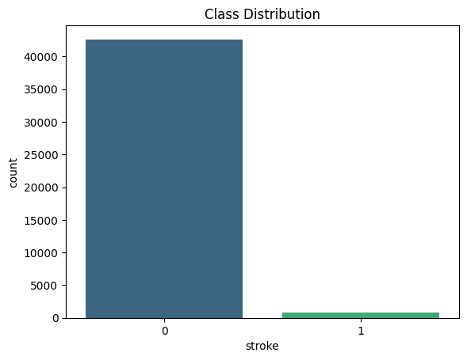

# Brain Stroke Prediction

This project applies exploratory data analysis (EDA) and machine learning models to predict the likelihood of stroke occurrence using patient demographic and medical history data.  
The aim is to identify high-risk individuals early and guide preventive healthcare strategies. 

---

##  Project Workflow

We evaluated model performance under three dataset conditions:
- **Case 1:** Imbalanced dataset (original)
- **Case 2:** Fully balanced dataset using SMOTE
- **Case 3:** Partially balanced dataset
- 
### 1. Data Loading & Cleaning
- Imported the dataset and handled missing values.
- Converted categorical variables into numerical form.
- Removed duplicates and corrected inconsistent data entries.

### 2. Exploratory Data Analysis (EDA)
- **Age Distribution**: Most patients were aged between 40–70 years.
- **Class Distribution**: Stroke cases were imbalanced, with fewer positive stroke cases.
- **Correlation Heatmap**: Found strong correlations between certain features (e.g., age, hypertension, heart disease).

### 3. Feature Engineering
- Created additional features like BMI categories and age groups.
- Normalized continuous variables for better model performance.

### 4. Model Building & Evaluation
- Tested multiple classification algorithms: Logistic Regression, Random Forest, Gradient Boosting, and XGBoost.
- Used metrics like Accuracy, Precision, Recall, F1-score, and ROC-AUC.
- **Feature Importance**: Identified key predictors such as age, average glucose level, and BMI.
- **Model Comparison**: Random Forest and XGBoost performed the best.

---

Key Visualizations & Insights

### 1️⃣ Case 1 – Class Distribution (Imbalanced Dataset)
  

-The dataset was heavily skewed towards non-stroke cases, with the minority class representing less than 1% of observations.

-All models showed high accuracy (~98%) but failed to identify any stroke cases (recall for class 1 = 0.00).

-This imbalance led to misleading metrics — accuracy appeared strong, but the models had no real predictive power for the minority class.
---

### 2️⃣ Case 1 – Age Distribution by Stroke Outcome
   

-This highlights the importance of age as a risk factor.
-Stroke cases were concentrated in individuals aged 40–80, with the majority of non-stroke cases occurring in younger individuals.

-This reinforces age as a significant risk factor, aligning with medical literature.


---

### 3️⃣ Case 1 – Correlation Heatmap
   
-Strongest correlations with stroke were found for age, hypertension, and heart disease.

-Average glucose level and BMI showed moderate positive correlations.

-These variables are medically interpretable and can guide targeted interventions.

---

### 4️⃣ Case 1 – ROC AUC Curves (Model Comparison)
  
-Logistic Regression achieved the highest ROC AUC score (0.8589) among the three models in the imbalanced scenario.

-Despite moderate AUC, all models had zero true positives for stroke, showing that AUC alone is insufficient without considering recall and F1-score for minority class.

---

### 5️⃣ Case 2 – Feature Importance (Best Model)
 
**Insight:**  
-Balancing the dataset improved detection of stroke cases (recall ~0.83–0.87) but slightly reduced performance for non-stroke cases (recall ~0.71–0.75).

-Random Forest marginally outperformed others, but all models performed closely.

-The most influential features included age, average glucose level, and hypertension, which can be prioritized in healthcare screenings.
---

### 6️⃣ Case 3 – Class Distribution (Partially Balanced Dataset)
 
**Insight:**  
-Partial balancing combined the benefits of maintaining the original distribution and improving minority class detection.

-Logistic Regression achieved the best overall trade-off, with recall for class 1 = 0.90 and class 0 = 0.72, and an AUC of 0.8933.

-This approach reduced both false positives and false negatives, making it the most practical and robust solution.


---

##  Key Impacts
- Improved **stroke prediction accuracy** by addressing extreme class imbalance.
- Identified **critical health factors** for early detection (age, glucose level, hypertension).
- Achieved **AUC score improvement from ~0.63 to 0.89** through strategic data balancing.
- Delivered interpretable insights to guide healthcare interventions.


---

## How to Run

### 1️Clone the Repository
```bash
git clone https://github.com/your-username/brain-stroke-prediction.git
cd brain-stroke-prediction
vvvvv
